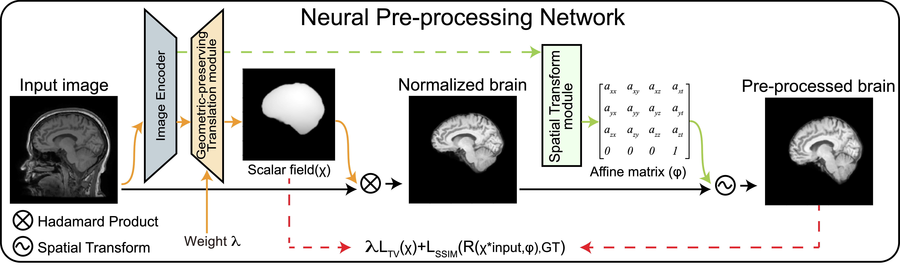

# Neural Pre-processing(NPP) 


**Objective**: NPP is an end-to-end weakly supervised learning approach for converting raw head MRI images to intensity-normalized, skull-stripped brain in a standard coordinate space. 

**Methods**: NPP solves three sub-tasks simultaneously through a neural network, without individual sub-task supervision. The sub-tasks include geometric-preserving intensity mapping, spatial transformation, and skull stripping. The model disentangles intensity mapping and spatial normalization to solve the under-constrained objective. 

**Results**: NPP outperforms the state-of-the-art methods, which tackle only a single sub-task, according to quantitative results. The importance of NPP's architecture design is demonstrated through ablation experiments. Additionally, NPP provides users with the flexibility to control each task during inference time. 

# Instructions
Neural Pre-processing (NPP) can be accessed in two ways - as a python library package or as a standalone utility using Docker or Singularity containers.

## Python library package (TODO)
To use the NPP library, either clone this repository and install the requirements listed in `setup.py` or install directly with pip.

```
pip install npp
```

## Containerized version
If you do not want to install our software package, you can run NPP through a standalone script that wraps a Docker or a Singularity container. These wrappers provide an easy mechanism for running NPP containers, so you do not need to worry about mounting paths to input and output files. For those interested, the underlying build image is available on Docker Hub.

Docker: To download the Docker-based wrapper script, run:

```curl -O https://raw.githubusercontent.com/Novestars/Neural-Pre-processing/master/npp_docker && chmod +x npp_docker``` 

Please read the brief instructions at the top of the downloaded script. 
### Usage
Once you download the Neural Pre-processing docker script, you can use NPP with the following command-line syntax:
 

``` npp_docker -i input -o preprocessed```

In this command, "input" represents the path to the input image and "preprocessed" is the pre-processed output. NPP generates brain mask, intensity normalized brain and intensity normalized brain in the standard coordinate space. For the large majority of images with voxel sizes near 1 mm3, NPP should run in less than 10 seconds on the CPU. As image size or resolution increases, the runtime might increase as well. If you encounter any issues, please contact the NPP development team for support.

# NPP Papers

If you use NPP or some part of the code, please cite:
 
  * Neural Pre-processing:   

    **Neural Pre-Processing: A Learning Framework for End-to-end Brain MRI Pre-processing.**  
[Xinzi He](https://www.bme.cornell.edu/research/grad-students/xinzi-he), Alan Wang, [Mert R. Sabuncu](http://sabuncu.engineering.cornell.edu/)  
arXiv 2023. [eprint arXiv:2303.12148](https://arxiv.org/abs/2303.12148)

# Pre-trained models
See list of pre-trained models available [here](https://www.dropbox.com/s/zbwuqinhuvf0thz/npp_v1.pth?dl=0).

# Data:
The Neural Pre-processing (NPP) model has been trained on a combination of seven different datasets, namely GSP, ADNI, OASIS, ADHD, ABIDE, MCIC, and COBRE. However, please note that most of the data used in the NPP papers cannot be shared due to redistribution restrictions. Nonetheless, if any researcher requires access to the Freesurfer outputs utilized during the training process, please feel free to contact me.


